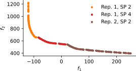
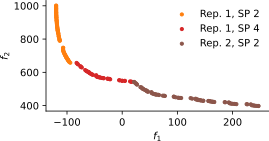

# Architecture Optimization Problems

Test problems ported from [jbussemaker/ArchitectureOptimizationExperiments](https://github.com/jbussemaker/ArchitectureOptimizationExperiments)
with updated pymoo version.

## Citing

For the accompanying paper, please refer to:
[Effectiveness of Surrogate-Based Optimization Algorithms for System Architecture Optimization](https://arc.aiaa.org/doi/10.2514/6.2021-3095)

Please cite this paper if you are using this code in your work.

## Installing

```
conda create --name opt_problems python=3.7
conda activate opt_problems
conda install numpy
pip install -r requirements.txt
```

## Package Structure

- `discrete.py` various mixed-discrete test problems
- `discretization.py` base classes and utilities for mixed-discrete test problems
- `hierarchical.py` various mixed-discrete hierarchical test problems
- `pareto_front.py` mixin for automatically calculating the Pareto front of a test problem
- `so_mo.py` various multi-objective versions of single-objective test problems
- `turbofan.py` the realistic engine architecting benchmark problem

## Analytical Test Problems

There are two main architecture benchmark problems. Both are based on the Goldstein problem, and include mixed-discrete
and hierarchical design variables, and have two objectives.

### Test Problem



Properties:
- 2 objectives
- 27 design variables
  - 16 continuous
  - 6 integer
  - 5 categorical
- ~42% of design variables are active in an initial DOE

```python
from arch_opt_exp.problems.hierarchical import MOHierarchicalTestProblem

problem = MOHierarchicalTestProblem()

# Determine the amount of active design points (due to design variable hierarchy)
problem.print_sparseness()

# Run an optimization using NSGA2 to visualize the Pareto front
problem.run_test()
```

### Test Problem with Hidden Constraints



Properties:
- Same as above
- ~60% of evaluations are invalid in an initial DOE

```python
from arch_opt_exp.problems.hierarchical import HCMOHierarchicalTestProblem

problem = HCMOHierarchicalTestProblem()

# Determine the amount of active design points (due to design variable hierarchy)
problem.print_sparseness()

# Determine the amount of failed evaluations: frac_nan is the fraction of evaluations returning NaN
from arch_opt_exp.metrics.performance import MaxConstraintViolationMetric
MaxConstraintViolationMetric.calc_doe(problem)

# Run an optimization using NSGA2
problem.run_test()
```
